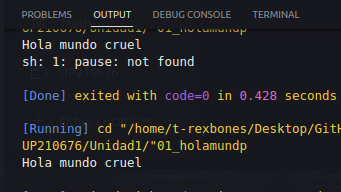
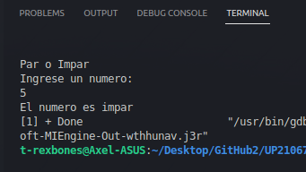
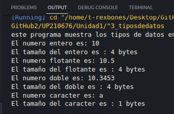
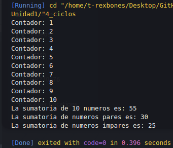
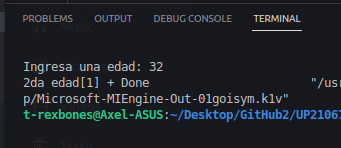

# 
Unidad 1

## 
 Axel Gutierrez Rodriguez  |  UP210676 | ISC03A 

  
En esta unidad utilizamos varios elementos de C++ como estructuras condicionales **IF** y de control como el **FOR** para solucionar varios problemas.
Aquí podran encotrar el resultado de los programas que realizamos.   
     
## Programa #1 **Hola mundo**

## Programa #2 **Par impar**

 
## Programa #3 **Tipos de datos**

## Programa #4 **Ciclos**

## Programa #5 **Edades**

