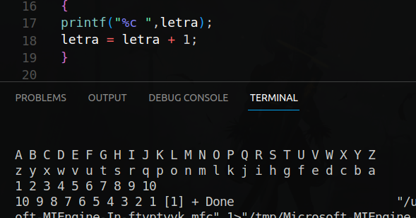

# 
Unidad 1

## 
 Axel Gutierrez Rodriguez  |  UP210676 | ISC03A 

  
En esta unidad utilizamos varios elementos de C++ como switch case, for anidados y utilizamos nuestro ingenio para encontrar la manera de resolver problemas un poco más comlejos que la unidad anterior. 
A continuación el funcionamiento de os programas realizados. Para conocer la descripció de cada uno, revisar directamente los codigos de este repositorio.   
    
## Programa Ejercicio #1 **Impuestos**

## Programa Ejercicio #2 **ABC**

## Programa Ejercicio #3 **Tablas**

## Programa Ejercicio #4 **Cilos While**

## Programa Ejercicio #5 **Tablas de Multiplicar**

## Programa Ejercicio #6 **sumatoria del 1 al 10**

## Programa Ejercicio #7 **Factorial del 1 al 5**

## Programa Ejercicio #8 **Ecuación cuadratica**

## Programa Ejercicio #9 **Cadenas**

## Programa Ejercicio #10 **Menú de opciones operaciones básicas**

## Programa Ejercicio #11 **Menú de opciones operaciones básicas**
 ###nofunciona 
## Programa Tarea #1 **Rendimiento**

## Programa Tarea #2 **Salas de Juegos**

## Programa Tarea #3 **Menú de Pizzas**

## Programa Tarea #4 **Temperaturas**

## Programa Tarea #5 **Productos Precio Factura**

## Programa Tarea #6 **Decimal a Binario**

